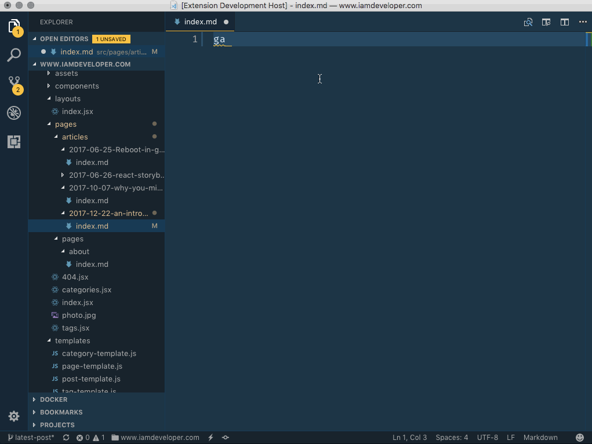

# vscode-gatsby-snippets README

Markdown snippets for GatsbyJS. [vscode-gatsby-snippets](https://marketplace.visualstudio.com/items?itemName=nickytonline.vscode-gatsby-snippets) is available on the VS Code Marketplace.

## Release Notes

### 1.0.3

Added list of shortcuts.

### 1.0.2

Added cheesy icon.

### 1.0.1

Added the GatbsyJS markdown page snippet.

### 1.0.0

Initial release.

---

## Gatsby snippets shortcuts

Press `Ctrl+Space` (Windows, Linux) or `Cmd+Space` (OSX) to see a list of Markdown snippets

- `ga` - creates a new article
- `gp` - creates a new page

## Working with Markdown

Here are some useful editor keyboard shortcuts:

- Split the editor (`Cmd+\` on OSX or `Ctrl+\` on Windows and Linux)
- Toggle preview (`Shift+CMD+V` on OSX or `Shift+Ctrl+V` on Windows and Linux)

### For more information

- [Visual Studio Code's Markdown Support](http://code.visualstudio.com/docs/languages/markdown)
- [Markdown Syntax Reference](https://help.github.com/articles/markdown-basics/)

**Enjoy!**
